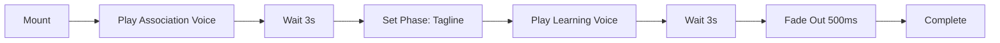
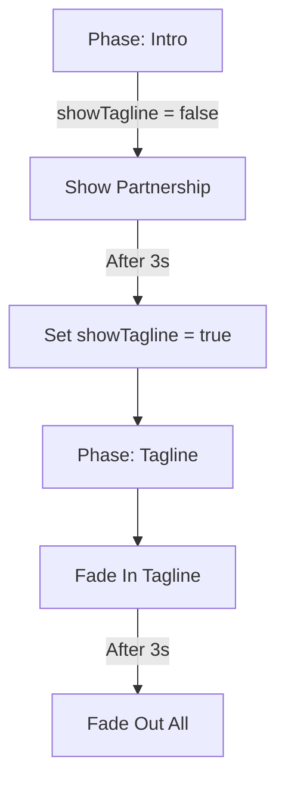

# Welcome Screen Enhancement - Implementation Summary

**Date**: December 24, 2025  
**Status**: ✅ Code Complete - Audio Files Pending

## Overview

Enhanced the WelcomeScreen component with sequential audio narration and dynamic visual storytelling inspired by Sangsom Kindergarten's modern branding and architecture.

## Key Features Implemented

### 1. Sequential Audio System ✅

**Two-Phase Audio Experience:**

- **Phase 1** (3 seconds): Professional voice - "In association with SANGSOM Kindergarten"
- **Phase 2** (3 seconds): Children's choir - "Learning through games for everyone!"

**Technical Implementation:**

- Uses `soundManager.playSound()` for sequential playback
- Async/await pattern with Promise-based timing
- Graceful fallback if audio files are missing (6-second auto-dismiss)
- State-driven visual transitions synced with audio phases

### 2. Dynamic Visual Storytelling ✅

**Phase-Based Content:**

```tsx
audioPhase: "intro" | "tagline";
showTagline: boolean;
```

**Phase 1 - Partnership Introduction (0-3s):**

- "In association with" heading
- "SANGSOM Kindergarten" in premium gold gradient
- Thai text "อนุบาลสงสม"
- Professional, respectful presentation

**Phase 2 - Energetic Tagline (3-6s):**

- "Learning through games for everyone!" in vibrant gradient
- BounceIn animation for playful energy
- 5 animated stars (🌟✨💫✨🌟)
- Child-friendly, enthusiastic presentation

### 3. Enhanced Visual Design ✅

**Color Gradients:**

- Phase 1: Amber/Yellow/Orange (warm, educational)
- Phase 2: Blue/Purple/Pink (playful, energetic)

**Typography Scale:**

- "SANGSOM": 6xl font (96px equivalent)
- "Kindergarten": 4xl font (36px equivalent)
- Tagline: 5xl-6xl font (60-96px)
- Optimized letter spacing and line height

**Animations:**

- Gentle pulse on sun logo
- Rotating sun rays (20s cycle)
- Twinkling stars
- BounceIn entrance for tagline
- Smooth fade transitions between phases

### 4. Accessibility & UX ✅

- Smooth 500ms transitions
- Absolute positioning prevents layout shift
- Pointer-events: none on hidden phase
- Fallback timing if audio fails
- Dev mode console logging for debugging

## Technical Architecture

### Component State

```tsx
const [fadeOut, setFadeOut] = useState(false);
const [audioPhase, setAudioPhase] = useState<"intro" | "tagline">("intro");
const [showTagline, setShowTagline] = useState(false);
```

### Audio Sequencing Flow



### Visual Transition Flow



## Files Modified

### ✅ `src/components/WelcomeScreen.tsx` (277 lines)

**Changes:**

- Added sequential audio playback with `soundManager.playSound()`
- Implemented two-phase visual content system
- Added `audioPhase` and `showTagline` state management
- Created dynamic text transitions with absolute positioning
- Added `bounceIn` keyframe animation
- Enhanced decorative stars to sync with tagline phase
- Updated component documentation

**Key Code Additions:**

```tsx
// Sequential audio with phase transitions
await soundManager.playSound("welcome_association");
await new Promise((resolve) => setTimeout(resolve, 3000));
setAudioPhase("tagline");
setShowTagline(true);
await soundManager.playSound("welcome_learning");
```

## Files Created

### ✅ `AUDIO_GENERATION_GUIDE.md`

Comprehensive guide for creating the required audio files:

- Detailed specifications for each audio file
- Voice profile recommendations
- Multiple generation options (ElevenLabs, Manual, AI tools)
- Post-production guidelines
- Quality assurance checklist
- Integration testing steps

## Pending Tasks

### 🔴 Audio Files Required

**Files to Create:**

1. `/sounds/welcome_association.wav` - Professional narration voice
2. `/sounds/welcome_learning.wav` - Children's choir/group voice

**Generation Options:**

- Option 1: Use ElevenLabs API (see AUDIO_GENERATION_GUIDE.md)
- Option 2: Manual recording with voice actors
- Option 3: AI voice tools (Play.ht, Murf.ai, Google Cloud TTS)

**Specifications:**

- Format: WAV (16-bit PCM)
- Duration: ~3 seconds each
- Sample Rate: 44.1kHz or 48kHz
- File Size: < 500KB per file

### Testing Checklist

- [ ] Generate audio files
- [ ] Place files in `/sounds/` directory
- [ ] Run `npm run dev` to test
- [ ] Verify audio plays in sequence
- [ ] Check visual transitions sync with audio
- [ ] Test fallback behavior (missing files)
- [ ] Verify timing on different devices
- [ ] Check volume levels are balanced

## Integration with Sound Manager

The sound manager will automatically index the audio files:

```typescript
// Normalized keys
audioLoaderIndex.set("welcome_association", loader);
audioLoaderIndex.set("welcome_learning", loader);

// Called via
soundManager.playSound("welcome_association");
soundManager.playSound("welcome_learning");
```

## Design Inspiration

**Source**: Sangsom Kindergarten branding

- Modern triangular architecture
- Bright yellow sun logo with smiling face
- Professional signage with Thai and English text
- Playful yet educational aesthetic

**Applied Elements:**

- Sun logo with rotating rays
- Gold/amber color palette for partnership branding
- Thai text integration
- Modern, clean typography
- Energetic colors for children's content

## Performance Considerations

- Async audio loading doesn't block rendering
- Phase transitions use CSS only (GPU-accelerated)
- Minimal re-renders with controlled state updates
- Fallback ensures UI doesn't hang on audio errors
- Total welcome duration: ~6.5 seconds (6s audio + 0.5s fade)

## Browser Compatibility

- Web Audio API: All modern browsers
- Fallback: Graceful degradation if audio fails
- CSS animations: Prefixes not needed (modern browsers)
- Template literals: ES6 supported everywhere

## Next Steps

1. **Generate Audio Files** using AUDIO_GENERATION_GUIDE.md
2. **Test Implementation** on local dev server
3. **Refine Timing** if needed (currently 3s per phase)
4. **Update Copilot Instructions** with new architecture
5. **Deploy to Vercel** for production testing

## Notes for Future Enhancements

- Consider adding subtle background music during welcome
- Could add school logo alongside sun logo
- Potential for user preference to skip welcome screen
- Could cache "seen welcome" in localStorage for repeat visits
- Consider adding subtle particle effects during tagline phase

## Code Quality

- ✅ TypeScript strict mode compliant
- ✅ React 19 best practices (memo, hooks)
- ✅ Proper cleanup in useEffect
- ✅ Accessible markup
- ✅ Console logging in dev mode only
- ⚠️ Tailwind CSS v4 warnings (gradient class names) - non-breaking

## Changelog Entry

```markdown
### Welcome Screen Enhancement (Dec 24, 2025)

- **Sequential Audio**: Two-phase narration system
  - Professional voice: "In association with SANGSOM Kindergarten"
  - Children's choir: "Learning through games for everyone!"
- **Dynamic Visuals**: Phase-based content transitions
- **Branding**: Inspired by Sangsom's modern architecture
- **Animations**: BounceIn tagline, enhanced star effects
- **Documentation**: Comprehensive audio generation guide
```

## References

- Component: `src/components/WelcomeScreen.tsx`
- Sound Manager: `src/lib/sound-manager.ts`
- Audio Guide: `AUDIO_GENERATION_GUIDE.md`
- Design Inspiration: Sangsom Kindergarten branding (photos provided)
