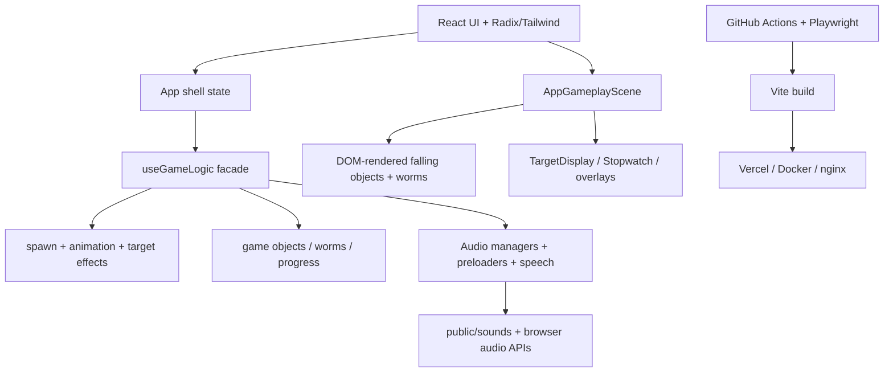

# Competition Readiness Roadmap — English-K1Run

Date: 2026-03-10
Scope: roadmap approved; first single-player competition-polish slice implemented on 2026-03-10.

## Executive summary

**Assessment:** strong single-player educational prototype, **not yet ready for international competition operations**.
**Readiness score:** 6.5/10 for showcase-grade single-player polish, 3/10 for competition operations.

Why: deterministic welcome start, core visible i18n, and public branding alignment have now landed, but release verification is still blocked by missing workspace dependencies and broader ops/security/runtime hardening remains open.

## Current architecture snapshot

Core evidence:



## Component breakdown

| Layer      | Current role                                             | Strengths                             | Concerns                                                       |
| ---------- | -------------------------------------------------------- | ------------------------------------- | -------------------------------------------------------------- |
| UI shell   | Menus, startup, settings, routing-like flow              | Modular enough, lazy-loading used     | Legacy docs/components still need drift cleanup                |
| Game logic | `useGameLogic` façade over spawn/effects/resources/state | Good single-source-of-truth direction | Fast-path state still drives React rerenders                   |
| Rendering  | DOM components for objects/worms                         | Easy to inspect/test                  | Poor fit for high object counts or tournament polish           |
| Audio      | Progressive loading + fallback chain                     | Robust fallback intent                | Runtime ElevenLabs path is not production-safe for competition |
| Storage    | localStorage + IndexedDB/Dexie                           | Fine for offline-first                | Not suitable for authoritative scoring/session ops             |
| Test infra | Playwright multi-browser + visual + a11y + CI shards     | Strong prototype QA base              | Needs smoke/staging/monitoring split                           |
| Deployment | Static-first with PWA, Vercel, Docker/nginx              | Flexible and demo-friendly            | No staged promotion, canary, or live ops visibility            |

## Cross-agent integrated attack plan

### Priority 0 — truth alignment

1. Treat the product as **single-player offline-first** unless leadership explicitly funds multiplayer.
2. Separate **demo-readiness** goals from **competition operations** goals.
3. Freeze feature sprawl until architecture, UX polish, QA topology, and security posture are normalized.

### Priority 1 — stabilize the runtime

1. Decouple simulation from React reconciliation.
2. Replace heuristic audio/runtime asset lookup with manifest-driven validation.
3. Remove browser-side premium TTS secrets from gameplay runtime.
4. Split oversized files to stay under repo constraints and reduce regression risk.

### Priority 2 — productionize delivery

1. Introduce smoke/staging/regression test tiers.
2. Add live error/performance telemetry and release gates.
3. Establish operator-focused startup and reset flows for demos/judging.

### Priority 3 — only then assess competitive expansion

1. If online competition is truly required, spin up a separate netcode track.
2. Avoid retrofitting multiplayer directly into current client-authoritative React runtime.

## Agent Alpha — architecture & performance

High-priority bottlenecks:

Recommended refactor path:

1. Move gameplay entities to an imperative render surface (Canvas/Pixi/Phaser-style) while keeping React for HUD/menus.
2. Keep `useGameLogic` as façade API, but extract a deterministic simulation core below it.
3. Add object pooling, lane buckets, and explicit performance budgets.
4. Break high-risk files into small modules before feature work resumes.

## Agent Beta — security & compliance

Verified status:

- `npm audit --audit-level=moderate` returns **0 vulnerabilities** as of this audit.
  Priority concerns:

1. Remove dependency on client-exposed premium API credentials for core experience.
2. Document storage boundaries: local-only scores are fine for offline use, not for trusted competition scoring.
3. Add stricter release checks for CSP/HSTS/permissions policy before public event deployment.
4. Treat anti-cheat as **not applicable today** because there is no networked competitive backend.

## Agent Gamma — QA & Playwright environment

Current strengths:

- Browser/device projects in `playwright.config.ts`; local tasks now default to `chromium`, `firefox`, and `mobile`, while `webkit`/`tablet` stay enabled in CI or on hosts that opt in with Playwright Linux dependencies installed.
  Target topology:

```text
Developer machine -> smoke suite (Chromium)
PR CI -> lint + build + smoke + targeted regression
Main CI -> full regression shard set + visual + accessibility
Staging deploy -> post-deploy smoke + diagnostics
Production deploy -> gated promotion + live telemetry + rollback path
```

Playwright roadmap:

- Phase 1: explicit `smoke`, `regression`, `visual`, `diagnostic` lanes.

## Agent Delta — netcode & multiplayer reality check

Current state:

- No matchmaking, lobby, session orchestration, WebSocket gameplay sync, rollback, prediction, or authoritative server.
  Decision gate:

- **If competition means judged single-station demo:** do not build multiplayer now.
  Netcode enhancement timeline if required:

- Tier 1 (4-6 weeks): backend skeleton, player/session model, transport choice, action schema.

## Agent Epsilon — UX/UI & player experience

Top improvement areas:

1. Target/announcement overlays should avoid blocking active play space.
2. Reduced-motion behavior should be complete, not partial.
3. Operator controls need fast paths: language, audio test, reset, fullscreen, skip intro.
4. Continue localizing legacy surfaces and screen-reader-only copy.
5. Validate the new welcome/start contract on real hardware after dependency install.

Wireframe concepts:

- **Attract screen:** title, one-sentence premise, Start Demo, Choose Level, language/audio controls top-right.

## Dependency map

| Domain             | Depends on                                      | Why it matters                                       |
| ------------------ | ----------------------------------------------- | ---------------------------------------------------- |
| Runtime refactor   | `useGameLogic`, scene rendering, audio timing   | Must land before major feature expansion             |
| Security hardening | audio/TTS path, deploy headers, release process | Needed before public competition deployment          |
| QA topology        | CI workflow, Playwright configs, staging URL    | Needed before reliable release gating                |
| UX polish          | menu/startup/settings/locales/audio cues        | Needed for judges and live operator confidence       |
| Netcode track      | deterministic simulation + backend platform     | Cannot start cleanly until runtime core is extracted |

## Risk matrix

| Risk                                          | Severity | Likelihood | Notes                                                 |
| --------------------------------------------- | -------- | ---------- | ----------------------------------------------------- |
| Gameplay frame pacing drops under load        | High     | High       | DOM/React render path is the primary bottleneck       |
| Live demo confusion in first 10 seconds       | High     | Medium     | Welcome/start and branding consistency matter heavily |
| Audio failure or quota issue in event setting | High     | Medium     | Client-side ElevenLabs path is fragile                |
| Regression leakage into release               | Medium   | Medium     | Strong base exists, but no staging gate yet           |
| International polish judged incomplete        | Medium   | High       | Visible i18n gaps remain                              |
| Multiplayer scope explosion                   | Critical | Medium     | No current platform support; easy to derail roadmap   |

## Milestones & success criteria

### Milestone A — competition showcase baseline (2-3 weeks)

- Smooth single-player runtime on target device class.
- Deterministic startup path with visible operator controls.
- Visible text fully localized for target showcase languages.
- Smoke/regression split active in CI.

### Milestone B — productionized single-player release (4-6 weeks)

- Staging deploy with post-deploy diagnostics.
- Runtime telemetry for errors, INP, LCP, and audio failures.
- Asset/audio manifest validation in build pipeline.
- No client-side premium API dependence for core flow.

### Milestone C — competition operations readiness (6-10 weeks)

- Performance budgets enforced.
- Release gating and rollback playbook documented.
- Accessibility and operator flows validated on real hardware.
- Formal go/no-go checklist for event deployment.

### Milestone D — multiplayer discovery only (after approval)

- Written product decision on whether online competition is actually required.
- Separate architecture brief and staffing estimate before any implementation.

## Recommendation

**Recommended path:** optimize and productionize this as a world-class **single-player competitive demo/classroom product first**. Do **not** begin multiplayer implementation until the user explicitly approves a separate Delta track.

## Execution update

Implementation was approved on 2026-03-10 for the single-player polish track.

- Completed slice: explicit-tap welcome audio start, localized level-select announcements, localized HUD labels, and unified public brand string `English K1 Run`.
- Verification status: editor diagnostics are clean for touched files.
- Remaining blocker: full WebKit/tablet verification still depends on Linux-native Playwright system packages that are unavailable via the distro's Ubuntu fallback dependency installer on this Parrot/Debian host.
